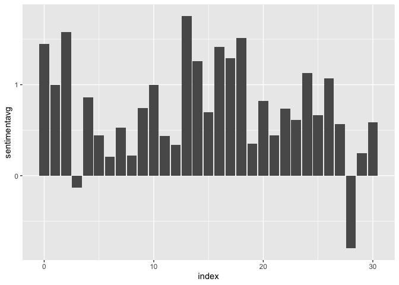

## Quarto and R

We can use Quarto with R!

``` r
library(tidyverse)
library(tidytext)
```

## Reading files in R

One way:

``` r
wtp1 = read_delim("pg67098.txt", delim = "\n", col_names = 'text')
```

## Tidy text

``` r
wtp_words <- wtp1 %>%
  mutate(linenumber = row_number()) %>%
  unnest_tokens(word, text)
wtp_words <- wtp_words %>%
  mutate(word = str_replace_all(word, "_", ""))
```

``` r
sentiments <- get_sentiments("afinn")
```

``` r
wtp_sentiments <- wtp_words %>%
  inner_join(sentiments) %>%
  mutate(index = linenumber %/% 80)
```

    Joining, by = "word"

``` r
wtp_summarized_sentiment <- wtp_sentiments %>%
  group_by(index) %>%
  summarize(sentimentsum = sum(value), sentimentavg = mean(value))
```

``` r
ggplot(wtp_summarized_sentiment) + geom_col(aes(x=index, y=sentimentavg))
```



## Writing out data

One way

``` r
write_delim(wtp1, file = "wtp_cleaned.txt", delim = "\n")
```

``` r
write_csv(wtp_summarized_sentiment, file = "sentiment_wtp.csv")
```
